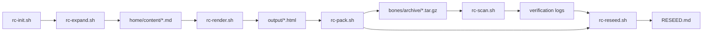

## 🛣️ Navigation
- [Back to Rotkeeper Docs](../index.md)
- [Technology: ChatGPT](../technology/chatgpt.md)
- [Technology: Sora](../technology/sora.md)

# Rotkeeper Workflow

This document outlines the full sequence of Rotkeeper rituals, from initializing a new repo to packing a tomb archive. Each step corresponds to a specific `rc-*.sh` script.

## 1. Initialization (`rc-init.sh`)

- **Purpose**: Bootstrap a new Rotkeeper repository.
- **Actions**:
  1. Copy core scripts and templates into `bones/`.
  2. Create essential folders (e.g., `bones/logs/`, `home/content/`).
  3. Set up default configuration files (`rotkeeper-bom.yaml`, `render-flags.yaml`).
- **Usage**:
  ```bash
  ./bones/scripts/rc-init.sh [--help]
  ```
- **Result**: A skeleton directory structure ready for content expansion.

## 2. Expand Content (`rc-expand.sh`)

- **Purpose**: Generate Markdown stub files from `rotkeeper-bom.yaml`.
- **Actions**:
  1. Lint frontmatter of BOM entries via `rc-lint.sh`.
  2. Skip any items with `status: draft`.
  3. Create directories and write stub `.md` files under `home/content/`.
- **Usage**:
  ```bash
  ./bones/scripts/rc-expand.sh [--dry-run] [--verbose] [--help]
  ```
- **Result**: Stub files in `home/content/` representing each content entry.

## 3. Render Pages (`rc-render.sh`)

- **Purpose**: Convert `home/content/*.md` into HTML using Pandoc.
- **Actions**:
  1. Run `rc-lint.sh` to validate frontmatter in `.md` files.
  2. Read `render-flags.yaml` for `content_dirs` and `output_dir`.
  3. For each `.md` (skipping drafts/logical recursion), run Pandoc with the appropriate template.
  4. Append rendered file paths to `bones/manifest.txt`.
- **Usage**:
  ```bash
  ./bones/scripts/rc-render.sh [--dry-run] [--verbose] [--help]
  ```
- **Result**: HTML files under `output/`, ready for packaging.

## 4. Pack Archive (`rc-pack.sh`)

- **Purpose**: Package rendered HTML into a tomb `.tar.gz` with metadata.
- **Actions**:
  1. Verify `output/<tomb>` directory exists.
  2. Generate unique archive name using timestamp (`%Y-%m-%d_%H%M%S`).
  3. Create checksum manifest inside the archive.
  4. Run `tar czf` and verify successful archive creation.
  5. Log summary (file count, size) to `bones/logs/`.
- **Usage**:
  ```bash
  ./bones/scripts/rc-pack.sh [--input <dir>] [--output <dir>] [--help]
  ```
- **Result**: A tomb archive in `bones/archive/` with embedded metadata and checksums.

## 5. Scan Archive (`rc-scan.sh`)

- **Purpose**: Verify integrity of a tomb archive or live directory.
- **Actions**:
  1. If given a `.tar.gz`, extract the checksum manifest.
  2. Compare actual files' checksums against recorded values.
  3. Report mismatches or missing files.
- **Usage**:
  ```bash
  ./bones/scripts/rc-scan.sh [--strict] [--help] <archive or directory>
  ```
- **Result**: Exit code `0` if no mismatches (or warnings), `1` if issues found.

## 6. Reseed Project (`rc-reseed.sh`)

- **Purpose**: Refresh the project’s reseed ritual document with current state.
- **Actions**:
  1. Read `RESEED.md` template.
  2. Update frontmatter `version:` and `updated:` to match HEAD.
  3. Write combined status of all scripts and configuration to `RESEED.md`.
- **Usage**:
  ```bash
  ./bones/scripts/rc-reseed.sh [--help]
  ```
- **Result**: `RESEED.md` is up-to-date, reflecting all current versions and pending tasks.

## 7. Help Aggregator (`rc-help.sh`)

- **Purpose**: Consolidate all script `--help` outputs into a single reference.
- **Actions**:
  1. Print a banner with project name and version.
  2. Loop through each `rc-*.sh` in `bones/scripts/`.
  3. Invoke the script with `--help` and display its usage.
- **Usage**:
  ```bash
  ./bones/scripts/rc-help.sh
  ```
- **Result**: A unified help index for all Rotkeeper CLI rituals.

---

## Schema References

- **rotkeeper-bom.yaml**: Defines `content: []` array with fields `filename, title, template, body, status, updated`.
- **render-flags.yaml**: Contains `content_dirs: []` (list of subdirectories under `home/content`) and `output_dir: <dir>`.
- **asset-manifest.yaml**: Maps `path → {checksum, version, tomb_id}` for automation tooling.

For detailed field definitions, see `schemas.md`.

---

## Diagram



*Figure: Rotkeeper end-to-end CLI workflow.*

---

## Navigation

- [Schemas](schemas.md)
- [Glossary](glossary.md)
- [Help Index](../../docs/bones/scripts/rc-help.md)

## 🛣️ Navigation (End)
- [Back to Rotkeeper Docs](../index.md)
- [Technology: ChatGPT](../technology/chatgpt.md)
- [Technology: Sora](../technology/sora.md)