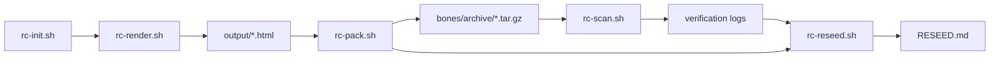

## 🛣️ Navigation
- [Back to Rotkeeper Docs](../index.md)
- [Technology: ChatGPT](../technology/chatgpt.md)
- [Technology: Sora](../technology/sora.md)

# Rotkeeper Workflow

This document outlines the full sequence of Rotkeeper rituals, from initializing a new repo to packing a tomb archive. Each step corresponds to a specific `rc-*.sh` script.

## 1. Initialization (`rc-init.sh`)

- **Purpose**: Bootstrap a new Rotkeeper repository.
- **Actions**:
  1. Copy core scripts and templates into `bones/`.
  2. Create essential folders (e.g., `bones/logs/`, `home/content/`).
  3. Set up default configuration files (`rotkeeper-bom.yaml`, `rotkeeper.yaml`).
- **Usage**:
  ```bash
  ./rotkeeper.sh init
  ```
- **Result**: A skeleton directory structure ready for content expansion.


## 3. Render Pages (`rc-render.sh`)

- **Purpose**: Convert `home/content/*.md` into HTML using Pandoc.
- **Actions**:
  2. Rely on environment defaults from `rc-env.sh` and config from `rotkeeper.yaml`.
  3. For each `.md` (skipping drafts/logical recursion), run Pandoc with the appropriate template.
  4. Append rendered file paths to `bones/manifest.txt`.
- **Usage**:
  ```bash
  ./rotkeeper.sh render [--dry-run] [--verbose] [--help]
  ```
- **Result**: HTML files under `output/`, ready for packaging.

## 4. Bind Documentation (`rc-book.sh`)

- **Purpose**: Aggregate markdown into structured documentation books.
- **Actions**:
  1. Parse comments from scripts into the scriptbook.
  2. Aggregate public documentation into the docbook.
  3. Collect system configurations into the configbook.
  4. Generate clean docbook version for downstream consumers.
- **Usage**:
  ```bash
  ./rotkeeper.sh book [--docbook | --scriptbook-full | --configbook | --all] [--help]
  ```
- **Result**: Markdown files are generated in `bones/reports/`:
  - `rotkeeper-scriptbook-full.md`
  - `rotkeeper-docbook.md`
  - `rotkeeper-configbook.md`
  - `rotkeeper-docbook-clean.md`

## 5. Pack Archive (`rc-pack.sh`)

- **Purpose**: Package rendered HTML into a tomb `.tar.gz` with metadata.
- **Actions**:
  1. Verify `output/<tomb>` directory exists.
  2. Generate unique archive name using timestamp (`%Y-%m-%d_%H%M%S`).
  3. Create checksum manifest inside the archive.
  4. Run `tar czf` and verify successful archive creation.
  5. Log summary (file count, size) to `bones/logs/`.
- **Usage**:
  ```bash
  ./rotkeeper.sh pack [--help]
  ```
- **Result**: A tomb archive in `bones/archive/` with embedded metadata and checksums.

## 6. Scan Archive (`rc-scan.sh`)

- **Purpose**: Verify integrity of a tomb archive or live directory.
- **Actions**:
  1. If given a `.tar.gz`, extract the checksum manifest.
  2. Compare actual files' checksums against recorded values.
  3. Report mismatches or missing files.
- **Usage**:
  ```bash
  ./rotkeeper.sh scan [--strict] [--help]
  ```
- **Result**: Exit code `0` if no mismatches (or warnings), `1` if issues found.

## 7. Reseed Project (`rc-reseed.sh`)

- **Purpose**: Refresh the project’s reseed ritual document with current state.
- **Actions**:
  1. Read `RESEED.md` template.
  2. Update frontmatter `version:` and `updated:` to match HEAD.
  3. Write combined status of all scripts and configuration to `RESEED.md`.
- **Usage**:
  ```bash
  ./rotkeeper.sh reseed [--help]
  ```
- **Result**: `RESEED.md` is up-to-date, reflecting all current versions and pending tasks.

---

## Schema References

- **rotkeeper-bom.yaml**: Defines `content: []` array with fields `filename, title, template, body, status, updated`.
- **asset-manifest.yaml**: Maps `path → {checksum, version, tomb_id}` for automation tooling.

For detailed field definitions, see `schemas.md`.

---

## Diagram


```mermaid
graph LR
  A[rc-init.sh] --> D[rc-render.sh]
  D --> E[output/*.html]
  E --> F[rc-pack.sh]
  F --> G[bones/archive/*.tar.gz]
  G --> H[rc-scan.sh]
  H --> I[verification logs]
  I --> K[rc-reseed.sh]
  F --> K
  K --> L[RESEED.md]
```

*Figure: Rotkeeper end-to-end CLI workflow.*

---

## Navigation

- [Schemas](schemas.md)
- [Glossary](glossary.md)


## 🛣️ Navigation (End)
- [Back to Rotkeeper Docs](../index.md)
- [Technology: ChatGPT](../technology/chatgpt.md)
- [Technology: Sora](../technology/sora.md)